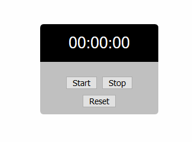

    Copyright (c) 2019
    Author: Chaitanya Tejaswi (github.com/CRTejaswi)    License: GPL v3.0+

## Day 1 - StopWatch [[source]](/001) [[video]](https://www.youtube.com/watch?v=Kfr0XwW4g-o)
A stopwatch utility with `Start`, `Stop` & `Reset` buttons that displays time in `HH:MM:SS` format.

### What's Next?
- [ ] Add Lap-timer, to measure time-duration of repetitive activities.  
_eg. Running laps around a public park._

    The Lap-timer must display timings in both relative & absolute units.  
    _eg. If you run the first and second laps in 00:10:30 and 00:09:45 respectively, the output should look something like this -_

  |#Lap | Timing |  Timing |
  |:---:|  :---: |  :---:  |
  |  1  |00:10:30|+00:10:30|
  |  2  |00:20:15|+00:09:45|

- [ ] Add millisecond value to improve timing precision.
- [ ] Export timing records to a CSV or JSON file.
- [ ] Publish the utility as a Chrome/Firefox extension.