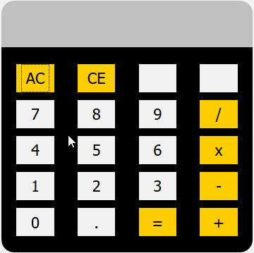

    Copyright (c) 2019
    Author: Chaitanya Tejaswi (github.com/CRTejaswi)    License: GPL v3.0+

## Day 2 - Calculator [[source]](/002) [[video]](https://www.youtube.com/watch?v=iu-j_T3ki24)
A 4-function `+-*/` calculator utility .

## What's Next?
- Add `+/-` button, to alternate number between positive & negative values.\
_eg. If display is `12`, press `+/-` to get `-12`, and vice-versa._
- Add mod (`%`) calculations.\
_eg. `12 % 5 = 2`._
- Publish the utility as a Chrome/Firefox extension.