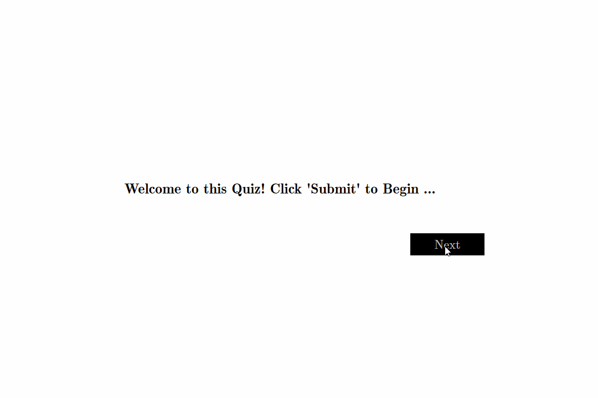

    Copyright (c) 2019
    Author: Chaitanya Tejaswi (github.com/CRTejaswi)    License: GPL v3.0+

## Day 3 - Quiz [[source]](/003) [[video]](https://www.youtube.com/watch?v=XYpZTBzxkOY)
An MCQ-type quiz utility.

- Quiz questions have been taken from [here](https://trivia.fyi/).
- Use of `Computer Modern` fonts have been made. Refer the HTML & CSS files if you're interested in the same.
- [x] __NOTE__: In Firefox, to permit sending requests, disable the __"Same-Origin Security Policy"__ by doing:\
  `about:config ===> security.fileuri.strict_origin_policy ===> false`

## What's Next?
- Add a feature that highlights the correct answer even if an incorrect option is chosen.
- Add separate intro & outro slides (views).
- Using [this template](resources/questions.md), make the utility more suitable for programming quizzes.
- Add images and audio-video content to enhance user-experience.
- Automate the generation of JSON file containing questions & answers.
- Publish the utility as a Chrome/Firefox extension.

## Additional Resources: [[1]][REF1] [[2]][REF2]

[REF1]: https://codepen.io/gcarino/pen/LDgtn
[REF2]: https://codepen.io/andy741231/pen/OXjNAZ